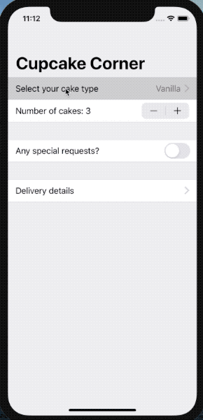

# CupcakeCorner

**SwiftUI app to place orders online. Form validation & GET/POST requests to a REST API.**




### Codable & @Published
They don't play nicely (yet). So to make a class conform to Codable, which contains @Published properties, the encoding & decoding functions have to be implemented "manually".

An alternative is to use a struct and wrap it in a class which conforms to ObservableObject. The class has the struct as a property and it can be @Published. This way the manual Codable implementation can be avoided:

```Swift
class Orders: ObservableObject {
    @Published var item = Order()
}

struct Order: Codable {...} 
```


### Animate multiple hidden controls at once
In the example below, where we want to show two additional Toggles based on the status of the first Toggle. By default SwiftUI animates the other two toggles sequentially, one by one. By adding the .animation() it will animate both of them at the same time.

```swift
Section {
	Toggle(isOn: $order.specialRequestEnabled.animation()) {
	    Text("Any special requests?")
	}

	if order.specialRequestEnabled {
	    Toggle(isOn: $order.extraFrosting) {
	        Text("Add extra frosting")
	    }

	    Toggle(isOn: $order.addSprinkles) {
	        Text("Add extra sprinkles")
	    }
	}
}
```

### .disabled()
The Model defines a Bool computed property which is true when all the fields are valid. 

```swift
Section {
    NavigationLink(destination: CheckoutView(order: order)) {
        Text("Check out")
    }
}.disabled(!order.hasValidAddress)

```

### Sending requests/Receiving data
We define a function inside the body View, and call it when the Place Order button is pressed.

```Swift
Button("Place Order") {
    self.placeOrder()
} 
```

In this function we will encode the order model to JSON, create a URL POST request and create a dataTask on the URLSession.shared singleton.

```Swift
let url = URL(string: "https://reqres.in/api/cupcakes")!
var request = URLRequest(url: url)
request.setValue("application/json", forHTTPHeaderField: "Content-Type")
request.httpMethod = "POST"
request.httpBody = encoded 
```

We check the response and show an alert if an error occured. Decode the JSON response and display a confirmation message.

### regres.in
This is a good way to test the networking layer of an app. When you send a request, to whatever path, it will send back the same data as a response.

## Day 76 - Accessibility Challenge
1. The check out view in Cupcake Corner uses an image that doesn’t add anything to the UI, so find a way to make the screenreader not read it out.
